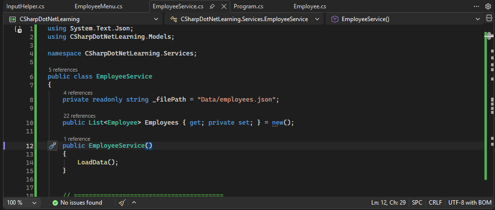
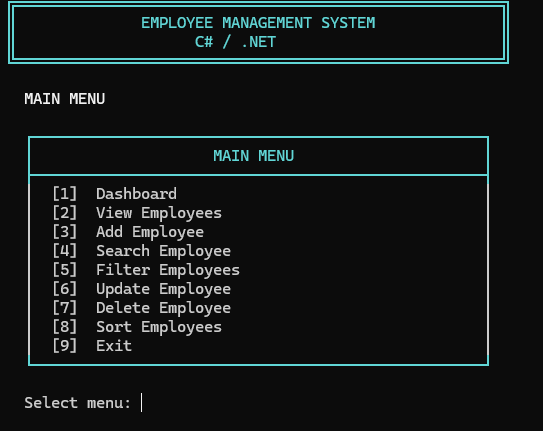
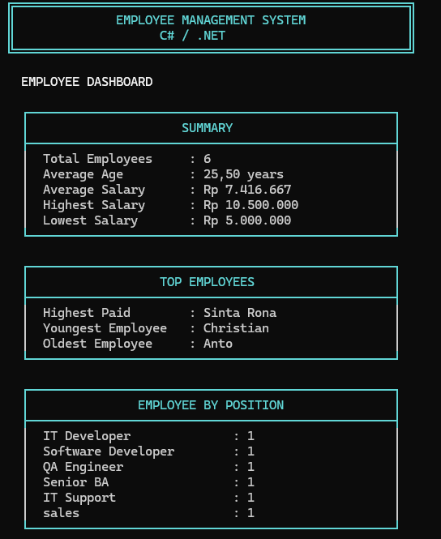

# C# Employee Management System

A console-based Employee Management System built with **C# and .NET**.

This project started as a hands-on learning project to practice C# fundamentals, Object-Oriented Programming, LINQ, file handling, JSON serialization, validation, and basic application structure.

The project is continuously improved as I learn more about C# and .NET.

## Features

- Create employee
- View employee list
- Update employee
- Delete employee
- Search employee by ID
- Search employee by name
- Filter employee by position
- Sort employees by:
  - Name
  - Age
  - Salary
- Employee dashboard
- Employee statistics
- Employee grouping by position
- Input validation
- JSON data persistence
- Console-based user interface
- Success, error, and warning messages

## Screenshots

### Development

The project is developed using Visual Studio with a simple separation between Models, Services, and UI components.



### Main Menu

The console application provides a menu for managing employee data.



### Employee Dashboard

The dashboard displays employee statistics such as total employees, average age, salary information, top employees, and employee distribution by position.



## Tech Stack

- C#
- .NET
- LINQ
- System.Text.Json
- JSON
- Object-Oriented Programming
- Git & GitHub

## Project Structure

```text
CSharpDotNetLearning/
├── Data/
│   └── employees.json
├── Models/
│   └── Employee.cs
├── Services/
│   └── EmployeeService.cs
├── UI/
│   ├── EmployeeMenu.cs
│   └── InputHelper.cs
├── Screenshots/
│   ├── coding.png
│   ├── main-menu.png
│   └── dashboard.png
├── .gitignore
├── CSharpDotNetLearning.csproj
├── Program.cs
└── README.md
```

## Application Structure

The application is separated into several parts:

### Models

Contains the data model used by the application.

```text
Models/
└── Employee.cs
```

### Services

Contains employee-related business logic and JSON data persistence.

```text
Services/
└── EmployeeService.cs
```

### UI

Contains the console menu, input handling, and display logic.

```text
UI/
├── EmployeeMenu.cs
└── InputHelper.cs
```

### Data

Contains employee data stored in JSON format.

```text
Data/
└── employees.json
```

### Screenshots

Contains screenshots of the development environment and application output.

```text
Screenshots/
├── coding.png
├── main-menu.png
└── dashboard.png
```

## How to Run

### 1. Clone the repository

```bash
git clone https://github.com/Chrisjohanes/csharp-employee-management-system.git
```

### 2. Navigate to the project

```bash
cd csharp-employee-management-system
```

### 3. Run the application

```bash
dotnet run
```

## Example Menu

```text
EMPLOYEE MANAGEMENT SYSTEM

[1] Dashboard
[2] View Employees
[3] Add Employee
[4] Search Employee
[5] Filter Employees
[6] Update Employee
[7] Delete Employee
[8] Sort Employees
[9] Exit
```

## Dashboard

The application provides basic employee statistics including:

- Total employees
- Average age
- Average salary
- Highest salary
- Lowest salary
- Highest-paid employee
- Youngest employee
- Oldest employee
- Employee count by position

## Search and Filter

Employees can be searched by:

- Employee ID
- Employee name

Employees can also be filtered by position.

The search and filter functionality uses LINQ and case-insensitive text matching.

## Sorting

Employees can be sorted by:

- **Name:** A-Z / Z-A
- **Age:** Youngest to Oldest / Oldest to Youngest
- **Salary:** Lowest to Highest / Highest to Lowest

## Data Persistence

Employee data is stored in:

```text
Data/employees.json
```

The application uses `System.Text.Json` to serialize and deserialize employee data.

This allows employee data to remain available after the application is closed and started again.

## Input Validation

The application validates user input including:

- Required text fields
- Employee ID
- Employee age between 18 and 65
- Positive salary values

Invalid input is rejected and the user is asked to enter the value again.

## Learning Goals

This project is part of my hands-on **C#/.NET learning journey**.

The main goals are to practice:

- C# syntax and fundamentals
- Classes and objects
- Object-Oriented Programming
- Collections
- LINQ
- Methods
- Conditional statements
- Loops
- Exception handling
- File I/O
- JSON serialization
- Input validation
- Basic separation of concerns
- Git and GitHub workflow

## Current Status

**Version 1.0**

The current version is a console-based Employee Management System using JSON as its data source.

The application currently supports CRUD operations, search, filtering, sorting, dashboard statistics, employee grouping by position, input validation, and JSON data persistence.

## Future Improvements

Planned improvements include:

- More filtering options
- Repository Pattern
- SQL Server database
- Entity Framework Core
- ASP.NET Core Web API
- Unit testing
- API documentation
- Authentication and authorization

## Learning Journey

This project is continuously improved as I learn more about C# and .NET.

The goal is to gradually evolve the application from a simple console application into a more complete .NET backend project.

## Repository

GitHub: https://github.com/Chrisjohanes/csharp-employee-management-system
